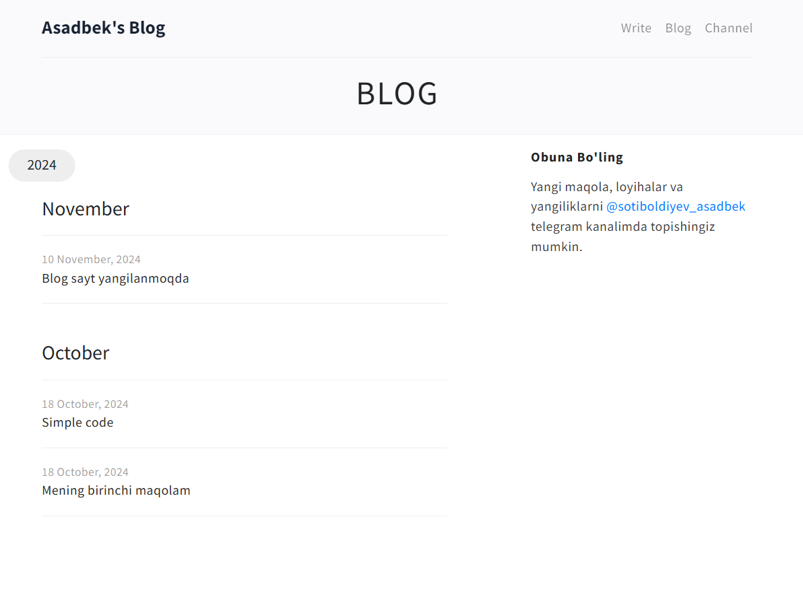

# Personal blog
</br>

## Azimjon Pulatovning blog sahifasi nusxasi. [azimjon.com](https://azimjon.com) 
## Texnalogiyalar:
- Backend: php, laravel
- Frontend: HTML, Css, Bootstrap
- Database: MySql



- [O'rnatish](#ornatish-va-ishga-tushirish)
- [Admin hisobni sozlash](#admin-hisobni-sozlash)
- [Telegram kanalga ulash](#telgram-kanalga-ulash)


## O'rnatish va ishga tushirish

Repositoryni yuklab oling:
``` bash
git clone https://github.com/asadbek-sotiboldiyev/asadbek-blog.git
cd asadbek-blog
```

Laravel frameworkini composer o'rnating:
``` bash
composer install
```

`.env.example` faylini `.env` fayliga nusxalang va `APP_KEY` ni yangilang:
``` bash
php artisan key:generate
```
Loyihani ishga tushiring:

``` bash
php artisan serve
```
### http://localhost:8000 da sayt ishga tushadi 

</br>
## Admin hisobni sozlash
`database/seeders/DatabaseSeeder.php` faylidagi kodni kommentdan chiqarib email va parol qo'ying.
Keyin terminalda ushbu kodni ishga tushiring:
``` bash
php artisan db:seed
```

**http://localhost:8000/login-for-admin/** sahifasi bilan admin hisobingizga kirin maqola yozishingiz mumkin.

</br>

## Telgram kanalga ulash
Blog saytingizga yangi maqola yozishingiz bilan, shu maqola avtomtik tarzda telgram kanalingizga yuboriladi.
Buning uchun:
- telegramda @botfather ga kirib bot oching.
- @botfather beran TOKEN ni `.env` dagi `BOT_TOKEN` ga qo'ying. 
- ochgan botingizni kanalingizga admin qilib tayinlang.
- @username_to_id_bot orqali kanalingiz `id` sini olib `BOT_TELEGRAM_CHANNEL_ID` ga qo'ying.
- `App/Http/Controllers/BotController.php` faylingi oxiridagi `false` ni `true` qilib o'zgartiring.

Endi siz yozgan maqolalar shu vaqtni o'zida telegram kanalingizga ham joylanadi.